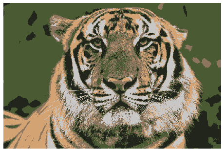

# Dominant-Color-Extraction-using-KMeans
Used KMeans algorithm to find the most dominant colors of a given image and created a new image with these dominant colors.

# SAMPLE
<table>
  <tr>
    <th>Original Image</th>
  <th>5 Dominant Colors</th>
  <th>Dominance of each color</th>
    <th>New Image</th>
  </tr>
  <tr>
    <td></td>
    <td></td>
  <td></td>
    <td></td>
</tr>
</table>
